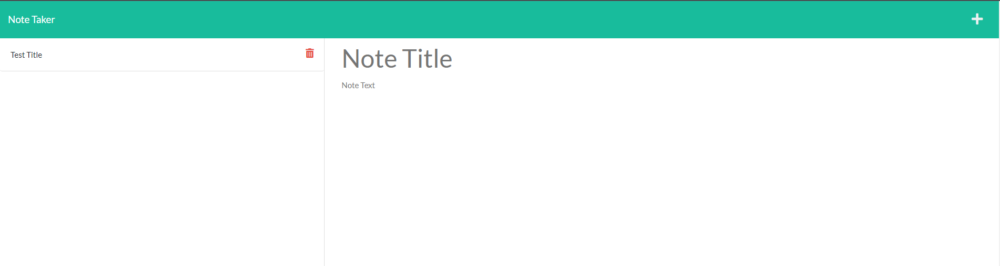

# Note Taker

  

  ## Description
  I created an easy to use note taker.  Write and save notes easily for future reference.  Clicking on previous notes will show the note on the main page.  Delete function added to remove notes so note area does not become cluttered with unneeded notes.
  
  ## Table of Contents
  
  - [Installation](#installation)
  - [Usage](#usage)
  - [License](#license)
  - [Contributing](#contributing)
  - [Tests](#tests)
  - [Questions](#questions)
  
  
  ## Installation
  
  NODE.js

  npm install
  

  ## Contributing
  
  No contributors on this project.
  
  
  ## Tests
  

  
  
  ## Questions

  If you have any questions about the project please contact me at.
  - [GitHub](https://github.com/Jsnyder159?tab=repositories)
  - Email: jw.snyder159@gmail.com